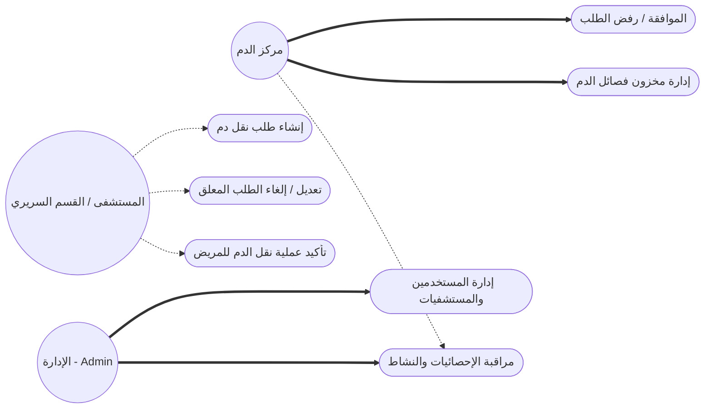
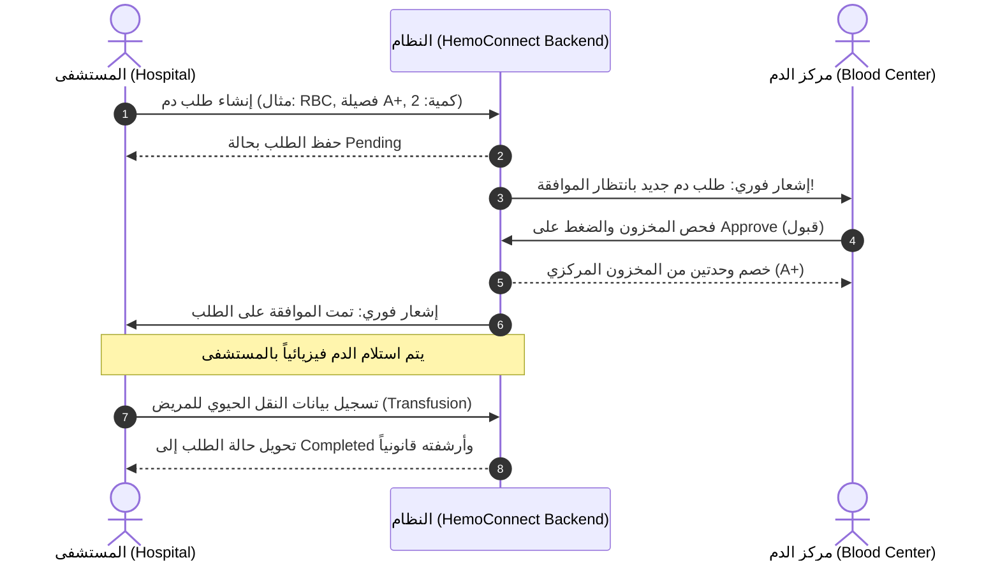
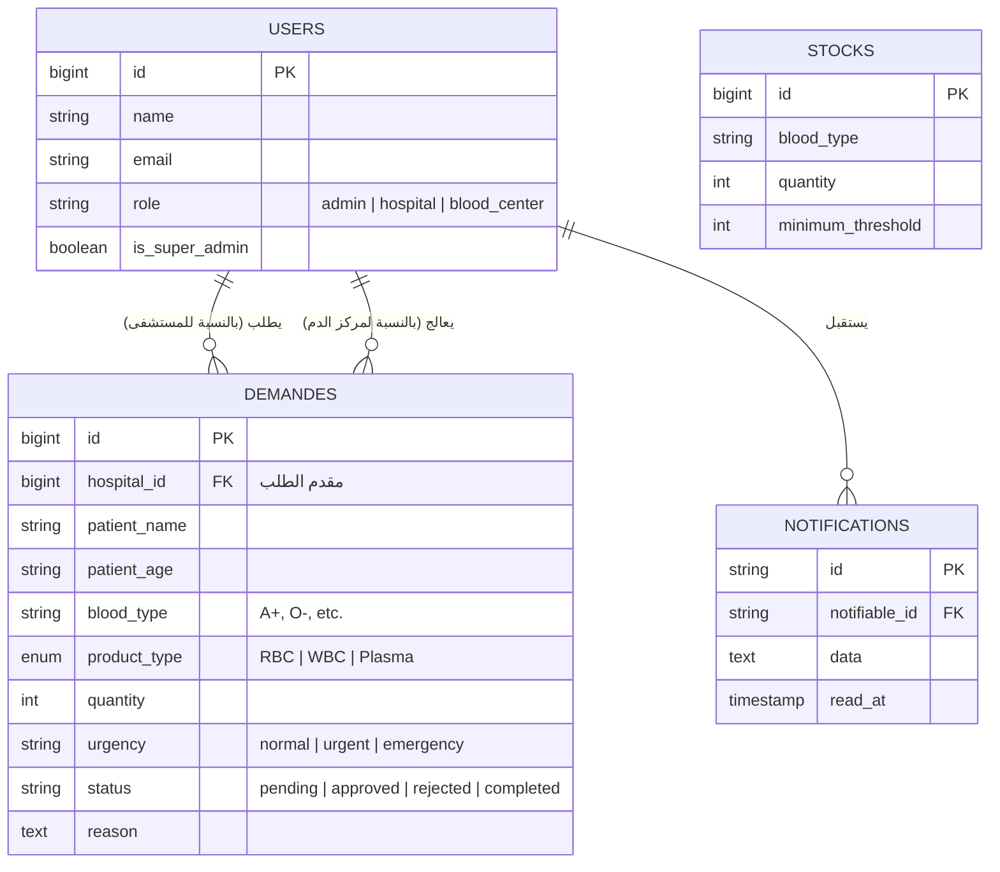

# تقرير مشروع: HemoConnect CHU 🩸
**النظام الذكي والمؤسسي لإدارة نقل الدم واليقظة الدموية**

---

## 1. مقدمة حول المشروع (Introduction)
يعتبر مشروع **HemoConnect CHU** منصة رقمية مركزية ومبتكرة، تم تطويرها خصيصاً لتحسين وتأمين سلسلة التوريد الخاصة بمنتجات الدم (RBC، WBC، Plasma) بين مركز تحاقن الدم والمستشفيات أو الأقسام السريرية. يهدف النظام إلى استبدال الإجراءات الورقية البطيئة والمعرضة للخطأ بنظام إلكتروني لحظي يضمن التتبع الكامل (Traceability) واليقظة الدموية (Hémovigilance)، مما يعزز أمان نقل الدم للمرضى وفقاً لمعايير الصحة العامة.

## 2. الأهداف الرئيسية (Objectifs Principaux)
- **الرقمنة الكاملة:** التخلص من المعاملات الورقية في طلبات الدم وإدارة المخزون.
- **السرعة والفعالية:** تقليل وقت الاستجابة بين طلب المستشفى وتوفير الدم من المركز.
- **التتبع والأمان (Traceability):** تتبع كيس الدم منذ خروجه من المركز وحتى نقله للمريض.
- **تقليل الأخطاء الطبية:** التحقق التلقائي من توافق فصائل الدم والكميات.
- **التحكم والشفافية:** توفير لوحات تحكم وإحصائيات دقيقة للإدارة العليا لمراقبة الأداء.

---

## 3. التقنيات المستخدمة (Stack Technique) 💻
تم بناء النظام باستخدام أحدث التقنيات البرمجية لضمان الأمان، السرعة، والقابلية للتوسع:

### **الواجهة الخلفية (Backend - API):**
- **الإطار (Framework):** Laravel 10 (PHP)
- **قاعدة البيانات:** MySQL (Relational Database)
- **المصادقة (Authentication):** Laravel Sanctum (Token-based API authentication)
- **الهيكلة:** RESTful API architecture

### **الواجهة الأمامية (Frontend - Client):**
- **الإطار (Library):** React.js (Vite)
- **إدارة الحالة (State Management):** React Hooks (useState, useEffect, useCallback)
- **التصميم وتجربة المستخدم (UI/UX):** TailwindCSS للمرونة، و Framer Motion للحركات والتفاعلات (Micro-animations).
- **التوجيه (Routing):** React Router DOM v6
- **التواصل مع الخادم:** Axios 
- **الترجمة المتعددة (Localization):** i18next (دعم كامل للعربية، الفرنسية، والإنجليزية، مع التوافق التام مع LTR و RTL).

---

## 4. بنية الصلاحيات والمستخدمين (RBAC - Role-Based Access Control) 🛡️
النظام مبني على نظام صلاحيات صارم يضم 4 أدوار أساسية:
1. **Super Admin (المدير العام):** تحكم مطلق في النظام، إضافة وحذف المستشفيات والمراكز، ومراقبة شاملة للنشاط.
2. **View-Only Admin (مراقب):** دور خاص بمدراء المستشفيات أو المفتشين للاطلاع على الإحصائيات وسير العمل دون قدرة على تعديل أو حذف أي بيانات (Read-Only).
3. **Blood Center (مركز الدم):** المسؤول المباشر عن إدارة مخزون الدم، استقبال طلبات المستشفيات (موافقة أو رفض)، وتوفير المنتجات المطلوبة.
4. **Hospital (المستشفى):** الجهة المستهلكة لمنتجات الدم؛ تقوم بإنشاء الطلبات لصالح المرضى، متابعة حالتها، تأكيد عملية التبرع/النقل للمريض (Transfusion)، ولديهم صلاحية تعديل أو إلغاء الطلب طالما أنه قيد الانتظار.

---

## 5. الميزات والوحدات الرئيسية (Fonctionnalités Clés) ⚙️

### أ. إدارة طلبات الدم (Gestion des Demandes)
- **إنشاء ذكي:** نموذج احترافي يطلب بيانات المريض (العمر، الاسم، فصيلة الدم)، ونوع المنتج بدقة (RBC كريات حمراء، WBC كريات بيضاء، Plasma بلازما)، والكمية، ودرجة الاستعجال (عادي، عاجل، طارئ).
- **دورة حياة الطلب (Lifecycle):** [Pending](file:///c:/projects/a-transfusion-backend/app/Models/Demande.php#60-64) (قيد الانتظار) ⬅️ [Approved](file:///c:/projects/a-transfusion-backend/app/Models/Demande.php#65-69) (مقبول) أو [Rejected](file:///c:/projects/a-transfusion-backend/app/Models/Demande.php#70-74) (مرفوض) ⬅️ [Completed](file:///c:/projects/a-transfusion-backend/app/Models/Demande.php#75-79) (مكتمل بعد نقل الدم).
- **المرونة:** إمكانية تعديل المستشفى لطلباتهم أو إلغائها فوراً قبل معالجتها من مركز الدم.

### ب. إدارة المخزون اللحظية (Gestion des Stocks en Temps Réel)
- لوحة تحكم مفصلة لمركز الدم تعرض الكميات المتاحة لكل فصيلة (A+, O-, AB+ ... إلخ).
- تنبيهات بصرية عند انخفاض المخزون عن الحد الأدنى (Low Stock Alerts).
- عمليات إضافة (Add) أو خصم (Deduct) يدوية أو أوتوماتيكية عند الموافقة على طلب مستشفى.

### ج. اليقظة الدموية وعمليات النقل (Hémovigilance & Transfusions)
- بمجرد قبول الطلب، يتم فتح سجل زمني دقيق لكل خطوة.
- يقوم المستشفى بتأكيد استلام الدم ونقله للمريض من خلال إدخال درجة حرارة المريض، والضغط، وأي مضاعفات (Allergic Reactions).
- يتم أرشفة هذه العمليات قانونياً ضمن سجلات النظام (Activity Logs).

### د. الإشعارات الحية والأنشطة (Notifications & Activity Logs) 🔔
- نظام إشعارات ذكي لا يُعلم المستخدمين بالتغييرات فحسب، بل يمكن التحكم به كاملًا (علامة المقروء، مسح الإشعار، مسح الكل).
- الاحتفاظ بسجل تاريخي (Audit Trail) لكل عملية تمت داخل النظام (من قام بماذا ومتى).

### هـ. لوحة القيادة والإحصائيات دقيقة (Tableau de Bord & Statistiques) 📊
- واجهة بانورامية تضم (Dashboard) مخصصة لكل دور.
- واجهة Super Admin تعرض رسوماً بيانية لتوزيع الفصائل الدموية الأكثر طلباً، ونسبة الطلبات المقبولة للمرفوضة، وتوزيع المستخدمين.

### و. دعم اللغات وتجربة المستخدم (Multilinguisme & UX) 🌍
- تم تصميم النظام ليقدم تجربة مستخدم (Premium UI)، مدعمة بنظام **الوضع الداكن (Dark Mode)** الحديث.
- تغيير لغة الواجهة فورياً بدون تحديث الصفحة (العربية، الفرنسية، الإنجليزية)، مع دعم اتجاه النصوص.
- نافذة تفاعلية (About Modal) مدعجة بلوغو النظام للتعريف المؤسسي.

---

## 6. الرسوم البيانية وهندسة النظام (Diagrammes UML & Architecture) 📈

لتبسيط فهم معمارية النظام في التقارير الأكاديمية والمؤسسية، نستعرض المخططات التالية:

### أ. مخطط حالات الاستخدام (Use Case Diagram)
يُظهر هذا المخطط المهام المحورية لكل مُمثل (Actor) تفاعلي داخل النظام:

### ب. مخطط التتابع لدورة الطلب (Sequence Diagram)
يوضح هذا المخطط تسلسل الأحداث الزمني منذ طلب المستشفى حتى عملية النقل (Transfusion)؛ مؤكداً مسار "اليقظة الدموية":

### ج. مخطط العلاقة بين الكيانات (ERD - Database Diagram)
يستعرض هيكل قاعدة البيانات العلائقية (SQL Relational Base) المصممة لضمان سلامة البيانات:

---

## 7. سير العمل النموذجي (Workflows Typiques) 🔄
*مثال لدورة طلب الدم:*
1. **المستشفى (Hospital):** يدخل النظام ويُنشئ [Demande](file:///c:/projects/a-transfusion-backend/app/Models/Demande.php#8-109) لمريض يحتاج لـ 3 وحدات فصيلة A+ نوع Plasma.
2. **النظام (System):** يتم إرسال إشعار فوري لـ `Blood Center`.
3. **مركز الدم (Blood Center):** يقوم بمراجعة المخزون. إذا كان كافياً، يضغط [Approve](file:///c:/projects/a-transfusion-backend/app/Models/Demande.php#65-69) (قبول).
4. **النظام (System):** يتم خصم 3 وحدات من مخزون مركز الدم A+ تلقائياً، وإرسال إشعار للمستشفى بأنه "تم الموافقة وتجهيز الطلب".
5. **المستشفى (Hospital):** بعد استلام الدم وتنفيذه على المريض، يقوم بالضغط على `Mark as Completed` ويُدخل الملاحظات الطبية لردود فعل المريض.
6. **النظام (System):** يتم أرشفة الطلب نهائياً وإغلاقه لدواعي اليقظة الدموية.

---

## 7. الخاتمة (Conclusion)
يُعد HemoConnect CHU خطوة محورية نحو انتقال المنظومة الصحية لبيئة عمل رقمية، خالية من الأوراق، وأكثر أماناً وموثوقية، ملبياً بذلك تطلعات العصر الحديث في التتبع الدقيق لحركة الدم (Veine à Veine)، وحماية حياة المرضى من أخطاء النقل البشري والتأخير الإداري.
