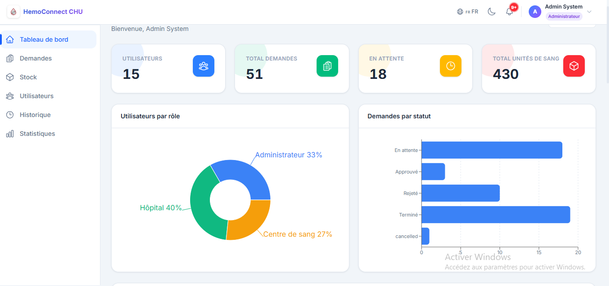
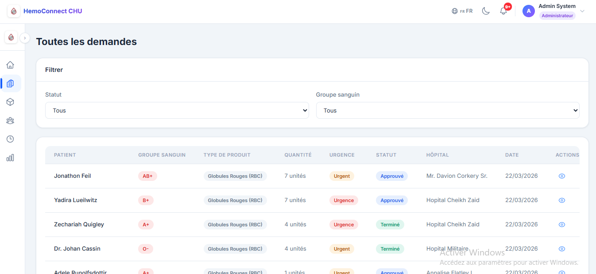
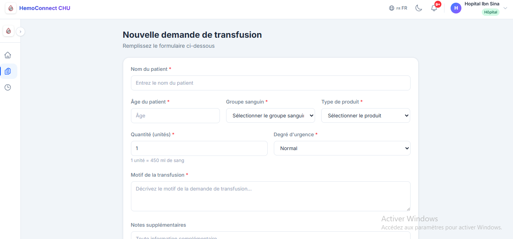
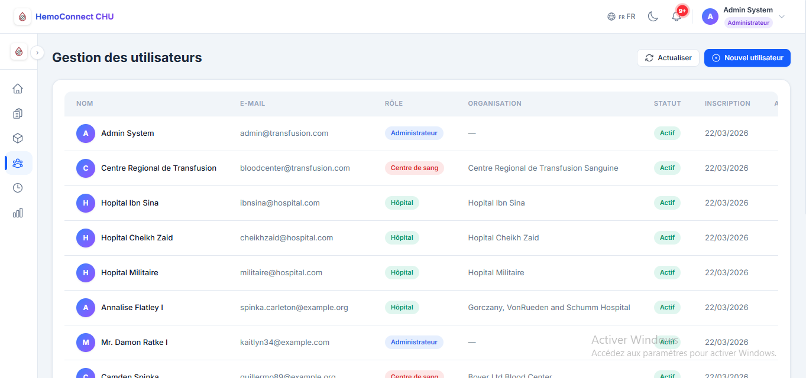
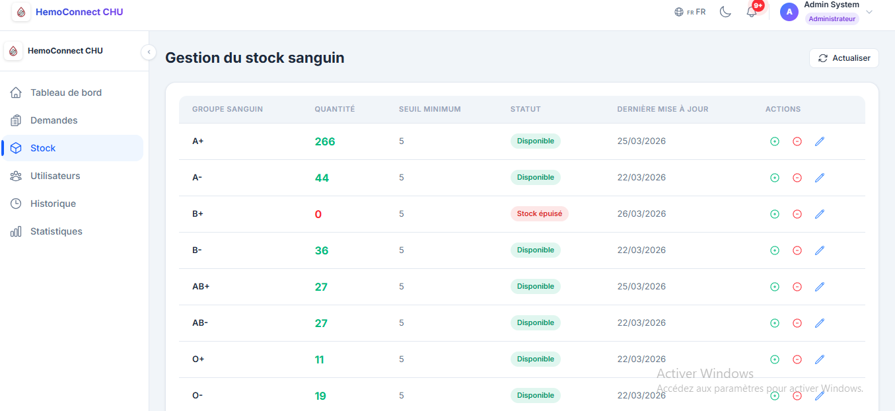
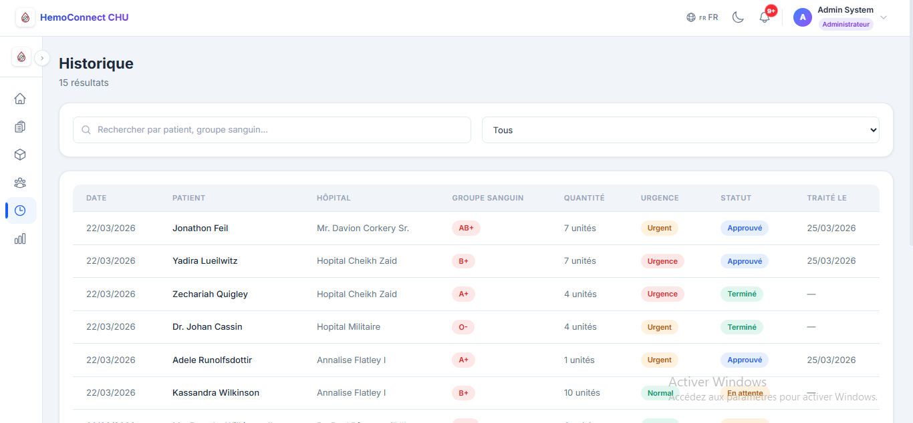
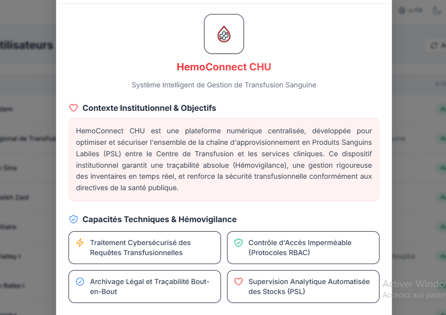

# 🩸 HemoConnect CHU

Plateforme web moderne pour la gestion des transfusions sanguines entre les centres hospitaliers, le centre du sang et l’administration.

---

## 📌 Description

**HemoConnect CHU** est une application web conçue pour digitaliser et optimiser la gestion des demandes de transfusion sanguine.

Elle permet de centraliser les informations, améliorer la communication entre les acteurs, et garantir une meilleure traçabilité et sécurité des opérations médicales.

---

## 🎯 Objectifs

* Digitaliser la gestion des transfusions sanguines
* Améliorer la traçabilité des demandes
* Réduire les délais de traitement
* Optimiser la gestion du stock sanguin
* Sécuriser l’accès aux données

---

## 👥 Acteurs du système

### 🏥 Centre hospitalier

* Créer une demande
* Suivre les demandes
* Annuler une demande non confirmée

### 🧪 Centre du sang

* Gérer le stock
* Traiter les demandes
* Mettre à jour les quantités

### 👨‍💼 Administrateur principal

* Gérer les utilisateurs
* Confirmer / supprimer les demandes
* Accès total

### 👁️ Administrateur superviseur

* Consulter uniquement
* Suivre les activités
* Accès en lecture seule

---

## 🧬 Produits sanguins

* Sang total
* Plasma
* Globules rouges
* Globules blancs

---

## ⚙️ Fonctionnalités principales

* 🔐 Authentification sécurisée
* 👥 Gestion des utilisateurs
* 📋 Gestion des demandes
* ❌ Annulation avant confirmation
* 🩸 Gestion du stock sanguin
* 📊 Tableau de bord
* 🕓 Historique des actions
* 🛡️ Gestion des rôles (RBAC)

---

## 🛠️ Technologies utilisées

### Backend

* Laravel
* REST API
* Sanctum / JWT
* MySQL

### Frontend

* React
* Axios
* React Router
* Tailwind CSS / CSS

---

## 📂 Structure du projet

```bash
HemoConnect-CHU/
│
├── backend/     # Laravel API
├── frontend/    # React App
└── README.md
```

---

## 🚀 Installation

### 1. Cloner le projet

```bash
git clone https://github.com/mohamed23-a/HemoConnect-CHU.git
cd HemoConnect-CHU
```

---

### 2. Backend (Laravel)

```bash
cd backend
composer install
cp .env.example .env
php artisan key:generate
```

Configurer la base de données dans `.env`, puis :

```bash
php artisan migrate
php artisan serve
```

---

### 3. Frontend (React)

```bash
cd frontend
npm install
npm run dev
```

---

## 🛡️ Sécurité

* Authentification sécurisée
* RBAC (gestion des rôles)
* Validation des données
* Protection CSRF
* Logs des actions

---

## 🔮 Perspectives

* Notifications en temps réel
* Version mobile
* Dashboard avancé
* Intelligence artificielle (prévision du besoin en sang)

---

## 👨‍💻 Auteur

**Mohamed Ajerdan**
OFPPT – Développement Digital

---

## 📜 Licence

Projet académique réalisé dans le cadre d’un stage.


## 📸 Aperçu

### 🔐 Login


### 📊 Dashboard


### 📋 Demandes


### ➕ Création demande


### 👥 Utilisateurs


### 🩸 Stock


### 🕓 Historique


### 🏥 Présentation

